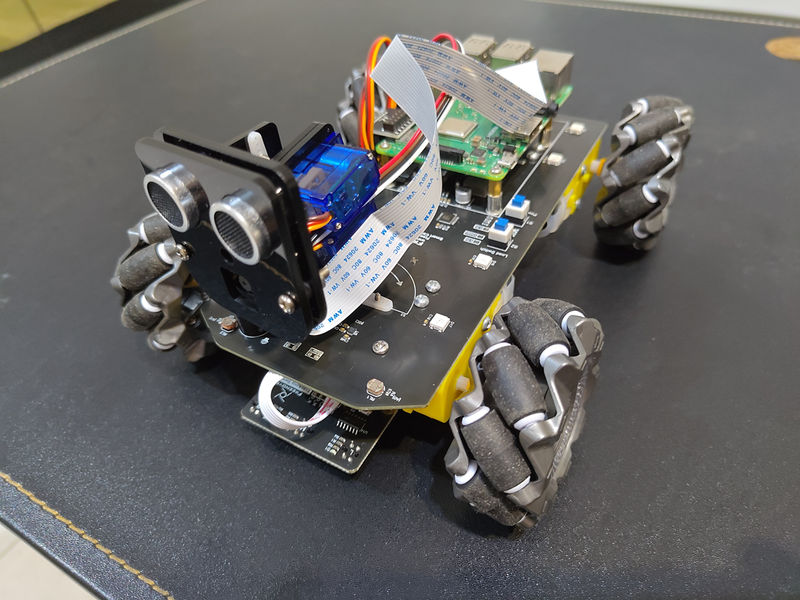

# Building_ROS2_on_Freenove_4WD_Smart_Car_Kit_for_Raspberry_Pi

Mini project for me to familiar with ROS 2.
Use ROS 2 to rebuild the functions of a 4MWD Smart Car Kit for Raspberry Pi from Freenove.

## Environment

- Raspberry Pi: Raspberry Pi 3 Model B+
- OS: Ubuntu 22.04.4 LTS
- ROS 2 version: Iron Irwini

## Progress

- [x] Distance Broadcast - ROS 2 topic - distance_broadcast_py
> Note: not one of the original functions of the car, built to practice ROS 2 topics.
- [x] Module test - ROS 2 service - module_test_py
  - [x] Motor
  - [x] ADC Module
  - [x] Infrared Line tracking module
  - [x] LED
  - [x] Buzzer
  - [x] Servo
  - [x] Ultrasonic module
  - [ ] Camera (camera module not working properly in Ubnutu)
- [ ] Light tracing Car
- [ ] Ultrasonic Obstacle Avoidance Car
- [ ] Infrared Line Tracking Car
- [ ] Smart video car

## License

CC BY-NC-SA 3.0